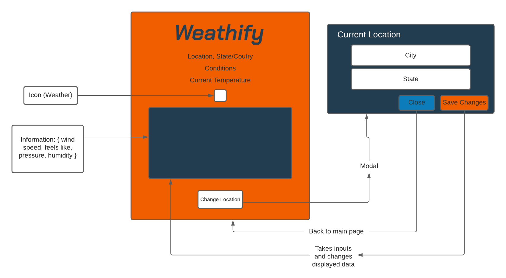

=======================================================

 ## A weather information app using OpenWeather API

=======================================================

 ### Project
 To design and build a single page, front end weather application that can allow a user to select the city and state (for US) or city and country code(RoW) and receive back information about the current weather conditions in that area.

 #### Information includes:
 * City name
 * State name
 * Current weather
 * Current temperature(celcius)
 * Icon representing the current weather
 * Relative humidity(%)
 * Pressure(hPa)
 * Feels like temperature(celcius)
 * Wind speed(m/s)

=======================================================
 ### Technologies Used
 * HTML
 * CSS (Bootstrap framework)
 * JavaScript
 * jQuery (very minimal)

 The idea behind this app was to use a minimal jQuery as possible. My goal was to build this primarily in standard JavaScript. There is one line of jQuery used to close the Modal.
 The finished article was then hosted on Surge.

=======================================================
### Features
* Clean and minimal design to present data clearly to the user.
* Stores information locally so that the current location will not reset upon browser refresh.
* Able to select weather from anywhere in the world.
  * City and State can be entered to retrieve US weather information.
  * City and Country Code can be entered to receive weather data from other countries.
* Icon representing current weather will dynamically change depending on conditions at chosen location.

=======================================================
### Mockup

